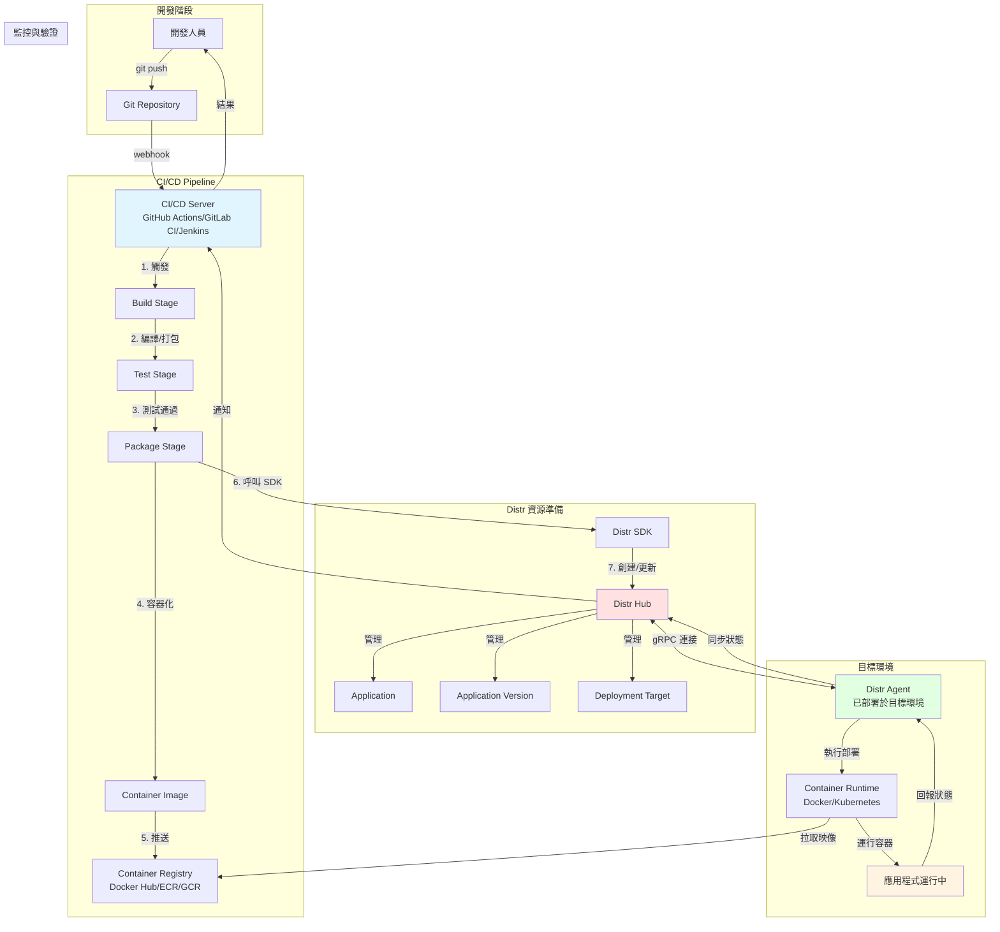
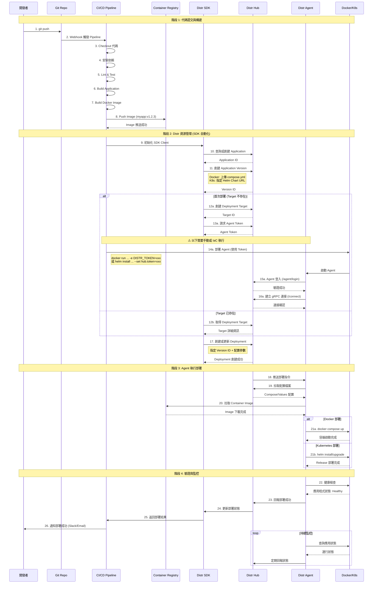

# CI/CD 到 Distr 部署完整流程文件

## CI/CD 打包到 Distr 部署完整流程圖

### 整體架構概覽



---

### 詳細步驟流程圖

```mermaid
flowchart TD
    Start([開發者 Push 代碼]) --> GitEvent[Git Repository 觸發 Webhook]
    GitEvent --> CITrigger[CI/CD Pipeline 啟動]

    CITrigger --> Checkout[Checkout 代碼]
    Checkout --> Install[安裝依賴<br/>npm install / go mod download]
    Install --> Lint[程式碼檢查<br/>ESLint / golangci-lint]
    Lint --> UnitTest[單元測試<br/>Jest / go test]

    UnitTest --> TestPass{測試通過?}
    TestPass -->|否| NotifyFail[通知開發者失敗]
    NotifyFail --> End1([結束])

    TestPass -->|是| Build[編譯/打包<br/>Build Binary/Bundle]
    Build --> DockerBuild[建置 Docker Image<br/>docker build]
    DockerBuild --> ImageScan[安全掃描<br/>Trivy / Snyk]

    ImageScan --> ScanPass{掃描通過?}
    ScanPass -->|否| NotifyVuln[通知安全漏洞]
    NotifyVuln --> End2([結束])

    ScanPass -->|是| TagImage[標記 Image<br/>app:v1.2.3 / app:latest]
    TagImage --> PushRegistry[推送到 Registry<br/>docker push]

    PushRegistry --> CallSDK[呼叫 Distr SDK]

    CallSDK --> CheckApp{Application<br/>是否存在?}
    CheckApp -->|否| CreateApp[創建 Application<br/>client.createApplication]
    CheckApp -->|是| GetApp[取得 Application<br/>client.getApplication]

    CreateApp --> CreateVersion[創建 Application Version]
    GetApp --> CreateVersion

    CreateVersion --> VersionType{部署類型?}

    VersionType -->|Docker| CreateDockerVer[創建 Docker Version<br/>上傳 Compose 檔案<br/>service.createDockerApplicationVersion]
    VersionType -->|Kubernetes| CreateK8sVer[創建 K8s Version<br/>指定 Helm Chart<br/>service.createKubernetesApplicationVersion]

    CreateDockerVer --> CheckTarget{Deployment Target<br/>是否存在?}
    CreateK8sVer --> CheckTarget

    CheckTarget -->|否| NeedAgent[需要部署新環境]
    CheckTarget -->|是| UpdateDeploy[更新現有 Deployment]

    NeedAgent --> CreateTarget[創建 Deployment Target<br/>client.createDeploymentTarget]
    CreateTarget --> GenToken[生成 Agent Token<br/>client.createAccessForDeploymentTarget]
    GenToken --> DeployAgent[部署 Agent 到目標環境<br/>⚠️ 需手動或 IaC 執行]

    DeployAgent --> AgentType{環境類型?}
    AgentType -->|Docker| DockerAgent[docker run distr-docker-agent]
    AgentType -->|Kubernetes| K8sAgent[helm install distr-k8s-agent]

    DockerAgent --> AgentConnect[Agent 連接至 Hub]
    K8sAgent --> AgentConnect

    AgentConnect --> CreateDeployment[創建 Deployment<br/>service.createDeployment]
    UpdateDeploy --> CreateOrUpdate[更新 Deployment<br/>service.updateDeployment]

    CreateDeployment --> HubPush[Hub 推送部署指令]
    CreateOrUpdate --> HubPush

    HubPush --> AgentReceive[Agent 接收指令]
    AgentReceive --> AgentPull[Agent 拉取配置]

    AgentPull --> ExecuteDeploy{執行部署}

    ExecuteDeploy -->|Docker| DockerDeploy[執行 docker compose up<br/>或 docker stack deploy]
    ExecuteDeploy -->|Kubernetes| K8sDeploy[執行 helm install/upgrade]

    DockerDeploy --> HealthCheck[健康檢查]
    K8sDeploy --> HealthCheck

    HealthCheck --> Healthy{應用程式健康?}

    Healthy -->|否| ReportFail[Agent 回報失敗]
    ReportFail --> Rollback[回滾到前一版本]
    Rollback --> NotifyDev[通知開發者部署失敗]

    Healthy -->|是| ReportSuccess[Agent 回報成功狀態]
    ReportSuccess --> HubUpdate[Hub 更新部署狀態]
    HubUpdate --> NotifySuccess[通知 CI/CD 部署成功]

    NotifySuccess --> Monitor[持續監控<br/>Agent 定期回報狀態]
    Monitor --> Complete([部署完成])

    NotifyDev --> End3([結束])

    style CallSDK fill:#e1f5ff
    style CreateDeployment fill:#ffe1e1
    style DeployAgent fill:#fff4e1
    style Complete fill:#e1ffe1
    style Rollback fill:#ffcccc
```



---

### 組件互動循序圖（含 CI/CD）



---

### GitHub Actions 完整範例

```yaml
# .github/workflows/deploy.yml
name: Build and Deploy to Distr

on:
  push:
    branches: [main, staging, production]
    tags: ['v*']

env:
  REGISTRY: ghcr.io
  IMAGE_NAME: ${{ github.repository }}

jobs:
  build-and-push:
    runs-on: ubuntu-latest
    outputs:
      image-tag: ${{ steps.meta.outputs.tags }}
      version: ${{ steps.meta.outputs.version }}

    steps:
      # 步驟 1-3: Checkout 和設定
      - name: Checkout code
        uses: actions/checkout@v4

      - name: Set up Docker Buildx
        uses: docker/setup-buildx-action@v3

      - name: Log in to Container Registry
        uses: docker/login-action@v3
        with:
          registry: ${{ env.REGISTRY }}
          username: ${{ github.actor }}
          password: ${{ secrets.GITHUB_TOKEN }}

      # 步驟 4-5: 測試
      - name: Run tests
        run: |
          npm install
          npm run lint
          npm run test

      # 步驟 6-8: 構建和推送 Image
      - name: Extract metadata
        id: meta
        uses: docker/metadata-action@v5
        with:
          images: ${{ env.REGISTRY }}/${{ env.IMAGE_NAME }}
          tags: |
            type=ref,event=branch
            type=semver,pattern={{version}}
            type=sha,prefix={{branch}}-

      - name: Build and push Docker image
        uses: docker/build-push-action@v5
        with:
          context: .
          push: true
          tags: ${{ steps.meta.outputs.tags }}
          labels: ${{ steps.meta.outputs.labels }}
          cache-from: type=gha
          cache-to: type=gha,mode=max

  deploy-to-distr:
    needs: build-and-push
    runs-on: ubuntu-latest

    steps:
      # 步驟 9-17: 使用 Distr SDK 部署
      - name: Checkout code (for compose files)
        uses: actions/checkout@v4

      - name: Setup Node.js
        uses: actions/setup-node@v4
        with:
          node-version: '20'

      - name: Install Distr SDK
        run: npm install @glasskube/distr-sdk

      - name: Deploy to Distr
        env:
          DISTR_API_KEY: ${{ secrets.DISTR_API_KEY }}
          IMAGE_TAG: ${{ needs.build-and-push.outputs.image-tag }}
          ENVIRONMENT: ${{ github.ref_name }}
        run: |
          node << 'EOF'
          const { Client, DistrService } = require('@glasskube/distr-sdk');

          const client = new Client({ apiKey: process.env.DISTR_API_KEY });
          const service = new DistrService({ apiKey: process.env.DISTR_API_KEY });

          async function deploy() {
            const appName = 'my-application';
            const env = process.env.ENVIRONMENT;
            const imageTag = process.env.IMAGE_TAG;

            // 1. 查詢或創建 Application
            let apps = await client.getApplications();
            let app = apps.find(a => a.name === appName);

            if (!app) {
              console.log('Creating new application...');
              app = await client.createApplication({
                type: 'kubernetes',  // 或 'docker'
                name: appName
              });
            }

            // 2. 創建新版本
            console.log(`Creating version for ${imageTag}...`);
            const version = await service.createKubernetesApplicationVersion(
              app.id,
              imageTag,
              {
                chartType: 'oci',
                chartUrl: 'oci://ghcr.io/myorg/my-chart',
                chartVersion: '1.0.0',
                baseValuesFile: `
                  image:
                    repository: ${process.env.IMAGE_TAG.split(':')[0]}
                    tag: ${process.env.IMAGE_TAG.split(':')[1]}
                  replicas: ${env === 'production' ? 3 : 1}
                `
              }
            );

            // 3. 查詢 Deployment Target
            const targets = await client.getDeploymentTargets();
            const targetName = `${appName}-${env}`;
            let target = targets.find(t => t.name === targetName);

            if (!target) {
              console.log('⚠️  Deployment Target not found!');
              console.log('Please create target and deploy agent first:');
              console.log(`Target Name: ${targetName}`);

              // 可選: 自動創建 Target
              target = await client.createDeploymentTarget({
                name: targetName,
                type: 'kubernetes',
                namespace: env,
                scope: 'namespace'
              });

              const access = await client.createAccessForDeploymentTarget(target.id);
              console.log('Agent deployment command:');
              console.log(`helm install distr-agent oci://ghcr.io/glasskube/distr/agent \\`);
              console.log(`  --namespace ${env} \\`);
              console.log(`  --set hub.token=${access.token}`);

              throw new Error('Please deploy agent first, then re-run this workflow');
            }

            // 4. 創建或更新 Deployment
            console.log(`Deploying to ${targetName}...`);
            const deployment = await service.updateDeployment({
              deploymentTargetId: target.id,
              application: {
                versionId: version.id
              },
              kubernetesDeployment: {
                releaseName: appName,
                valuesYaml: `
                  environment: ${env}
                  ingress:
                    enabled: true
                    hosts:
                      - ${env}.myapp.com
                `
              }
            });

            console.log('✅ Deployment successful!');
            console.log(`Version: ${imageTag}`);
            console.log(`Target: ${targetName}`);
          }

          deploy().catch(err => {
            console.error('❌ Deployment failed:', err);
            process.exit(1);
          });
          EOF

      # 步驟 26: 通知
      - name: Notify deployment result
        if: always()
        uses: 8398a7/action-slack@v3
        with:
          status: ${{ job.status }}
          text: |
            Deployment to ${{ github.ref_name }}: ${{ job.status }}
            Image: ${{ needs.build-and-push.outputs.image-tag }}
          webhook_url: ${{ secrets.SLACK_WEBHOOK }}
```

---

### GitLab CI 完整範例

```yaml
# .gitlab-ci.yml
stages:
  - test
  - build
  - deploy

variables:
  DOCKER_DRIVER: overlay2
  IMAGE_TAG: $CI_REGISTRY_IMAGE:$CI_COMMIT_SHORT_SHA

# 步驟 4-5: 測試階段
test:
  stage: test
  image: node:20
  script:
    - npm install
    - npm run lint
    - npm run test
  only:
    - main
    - staging
    - production

# 步驟 6-8: 構建和推送
build:
  stage: build
  image: docker:24
  services:
    - docker:24-dind
  before_script:
    - docker login -u $CI_REGISTRY_USER -p $CI_REGISTRY_PASSWORD $CI_REGISTRY
  script:
    - docker build -t $IMAGE_TAG .
    - docker tag $IMAGE_TAG $CI_REGISTRY_IMAGE:latest
    - docker push $IMAGE_TAG
    - docker push $CI_REGISTRY_IMAGE:latest
  only:
    - main
    - staging
    - production

# 步驟 9-17: Distr 部署
deploy:
  stage: deploy
  image: node:20
  before_script:
    - npm install -g @glasskube/distr-sdk
  script:
    - |
      cat > deploy.js << 'EOFJS'
      const { Client, DistrService } = require('@glasskube/distr-sdk');

      // (與 GitHub Actions 範例相同的邏輯)
      // ...
      EOFJS
    - node deploy.js
  environment:
    name: $CI_COMMIT_REF_NAME
    url: https://$CI_COMMIT_REF_NAME.myapp.com
  only:
    - main
    - staging
    - production
```

---

### Terraform 自動化 Agent 部署（解決手動步驟）

```hcl
# terraform/distr-agent/main.tf

# 步驟 12-13: 使用 Terraform 創建 Target 並獲取 Token
resource "null_resource" "distr_target" {
  provisioner "local-exec" {
    command = <<EOF
      node -e "
      const { Client } = require('@glasskube/distr-sdk');
      const fs = require('fs');

      async function setup() {
        const client = new Client({ apiKey: '${var.distr_api_key}' });

        const target = await client.createDeploymentTarget({
          name: '${var.environment}-k8s',
          type: 'kubernetes',
          namespace: '${var.environment}',
          scope: 'namespace'
        });

        const access = await client.createAccessForDeploymentTarget(target.id);

        fs.writeFileSync('agent-token.txt', access.token);
        console.log('Target created:', target.id);
      }

      setup();
      "
    EOF
  }
}

# 步驟 14-16: 自動部署 Agent
resource "helm_release" "distr_agent" {
  depends_on = [null_resource.distr_target]

  name       = "distr-agent"
  repository = "oci://ghcr.io/glasskube/distr"
  chart      = "agent"
  namespace  = var.environment

  set_sensitive {
    name  = "hub.token"
    value = file("${path.module}/agent-token.txt")
  }

  set {
    name  = "hub.url"
    value = var.distr_hub_url
  }
}

# 清理 token 檔案
resource "null_resource" "cleanup" {
  depends_on = [helm_release.distr_agent]

  provisioner "local-exec" {
    command = "rm -f agent-token.txt"
  }
}
```

---

### 關鍵決策點總結

| 決策點 | 選項 A | 選項 B | 建議 |
|--------|--------|--------|------|
| **CI/CD 工具** | GitHub Actions | GitLab CI | 根據現有基礎設施 |
| **部署類型** | Docker | Kubernetes | 生產環境建議 K8s |
| **Agent 部署** | CI/CD 手動觸發 | Terraform 自動化 | Terraform (可重現) |
| **版本標記** | Git SHA | Semantic Version | 正式環境用 SemVer |
| **環境策略** | 單 Target 多環境 | 每環境獨立 Target | 獨立 Target (隔離) |
| **回滾策略** | 切換 Version | Git Revert | 切換 Version (快速) |

---

### 安全最佳實踐

#### Secrets 管理

```yaml
# GitHub Secrets 需要設定:
# - DISTR_API_KEY: Distr Personal Access Token
# - SLACK_WEBHOOK: 通知 Webhook (可選)
# - REGISTRY_TOKEN: Container Registry 認證 (如需要)

# 在 CI/CD 中使用:
env:
  DISTR_API_KEY: ${{ secrets.DISTR_API_KEY }}
```

#### Agent Token 處理

```bash
# ❌ 錯誤: 不要將 Agent Token 寫入日誌
echo "Agent Token: $TOKEN"

# ✅ 正確: 使用環境變數或 Secret 管理
kubectl create secret generic distr-agent \
  --from-literal=token=$TOKEN \
  --dry-run=client -o yaml | kubectl apply -f -
```

---

## 完整流程時間估算

| 階段 | 步驟 | 預估時間 | 備註 |
|------|------|---------|------|
| **代碼到構建** | 1-8 | 5-15 分鐘 | 視測試複雜度 |
| **Distr 資源管理** | 9-17 | 1-3 分鐘 | SDK 呼叫快速 |
| **Agent 部署** | 14-16 | 5-10 分鐘 | 僅首次需要 |
| **應用部署** | 18-23 | 3-10 分鐘 | 視 Image 大小 |
| **驗證監控** | 24-26 | 1-2 分鐘 | 健康檢查 |
| **總計 (首次)** | - | **15-40 分鐘** | 含 Agent 部署 |
| **總計 (更新)** | - | **9-30 分鐘** | 不含 Agent 部署 |

---

## 故障處理檢查清單

### CI/CD Pipeline 失敗

- [ ] 檢查測試是否通過
- [ ] 檢查 Docker 構建日誌
- [ ] 驗證 Registry 認證
- [ ] 確認環境變數正確設定

### Distr SDK 呼叫失敗

- [ ] 驗證 DISTR_API_KEY 有效性
- [ ] 檢查網路連接到 Distr Hub
- [ ] 確認 Application/Target 名稱正確
- [ ] 查看 SDK 返回的錯誤訊息

### Agent 部署失敗

- [ ] 驗證 Agent Token 正確
- [ ] 檢查目標環境網路可達性
- [ ] 確認 Helm Chart 版本相容
- [ ] 查看 Agent 啟動日誌

### 應用部署失敗

- [ ] 檢查 Agent 是否連接至 Hub
- [ ] 驗證 Compose/Helm 配置語法
- [ ] 確認 Container Image 可拉取
- [ ] 查看目標環境資源是否充足

---

**文件版本**：1.0
**最後更新**：2025-10-28
**適用版本**：Distr v1.14.1+, GitHub Actions, GitLab CI, Terraform
