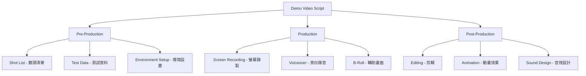
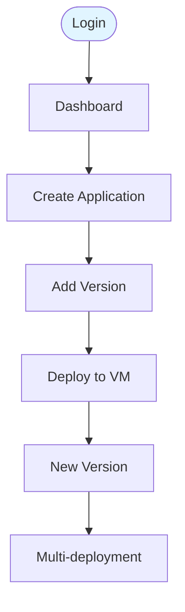
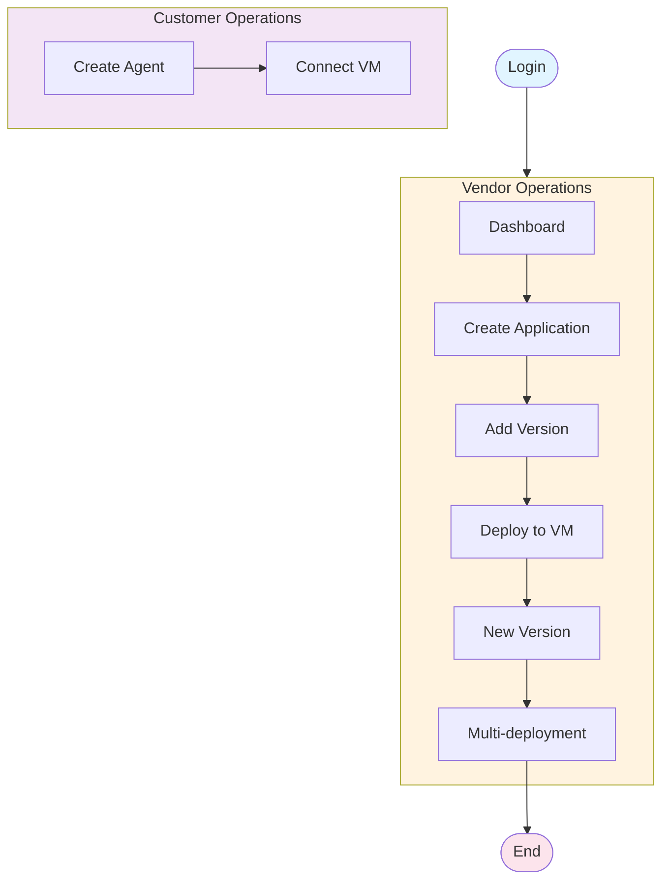
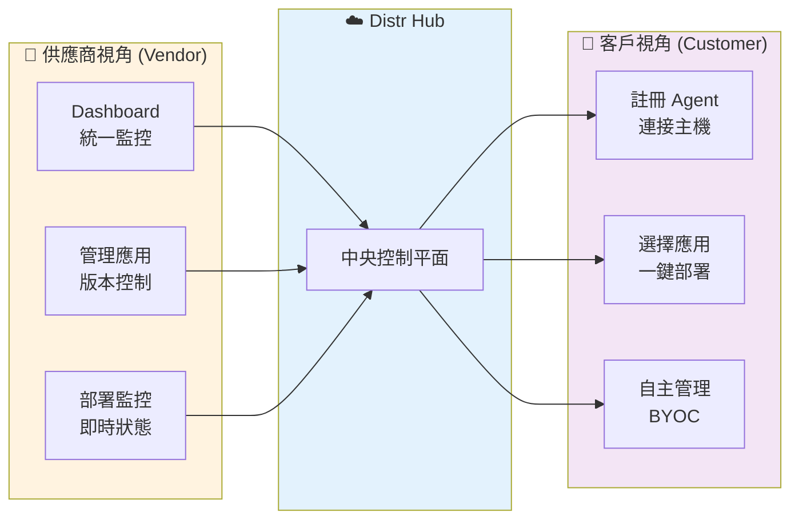
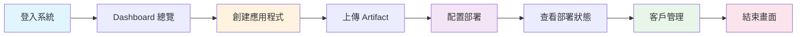
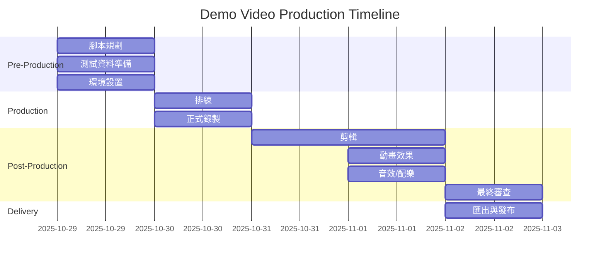

# Distr 平台展示影片腳本

> **文件類型：** Video Production Script / Shot List / Screen Recording Rundown
> **目標受眾：** 潛在客戶、技術決策者
> **展示目標：** 展現 Distr 作為軟體分發平台的核心功能與價值

---

## 📋 目錄

- [專業術語說明](#專業術語說明)
- [版本一：1 分鐘快速展示](#版本一1-分鐘快速展示)
- [版本二：1 分 30 秒完整展示](#版本二1-分-30-秒完整展示)
- [測試資料準備清單](#測試資料準備清單)
- [拍攝前檢查清單](#拍攝前檢查清單)
- [後製建議](#後製建議)

---

## 📖 專業術語說明

### 影片製作領域的腳本規劃文件

在影像錄製和影片製作領域，這類步驟規劃文件有以下專業名稱：

| 術語 | 英文 | 說明 | 適用場景 |
|------|------|------|---------|
| **分鏡腳本** | Storyboard | 視覺化的腳本，包含每個鏡頭的草圖 | 動畫、廣告、電影 |
| **拍攝腳本** | Shooting Script | 詳細的拍攝指示，包含場景、動作、對話 | 實景拍攝、訪談 |
| **鏡頭清單** | Shot List | 列出所有需要拍攝的鏡頭和順序 | 影片拍攝 |
| **流程表** | Rundown | 時間軸形式的執行流程 | 直播、活動、新聞節目 |
| **螢幕錄製腳本** | Screen Recording Script | 針對軟體操作錄製的詳細步驟 | 軟體教學、產品展示 |
| **影片腳本** | Video Script | 包含旁白、字幕、動作的完整腳本 | 所有類型影片 |

**本文件屬於：Screen Recording Script + Shot List + Rundown 的綜合形式**

### 軟體展示影片（Demo Video）的標準組成



---

## 版本一：1 分鐘快速展示

### 🎯 展示目標
- **核心訊息：** Distr 簡化軟體分發，實現供應商到客戶的完整部署流程
- **關鍵賣點：** 供應商中央管理 + 客戶自主部署
- **展示亮點：** 實際運行的服務狀態監控
- **目標受眾：** 技術主管、DevOps 團隊、BYOC 場景

### 📊 展示流程圖

#### 時間軸（Gantt Chart）

```mermaid
gantt
    title 1 分鐘展示流程時間軸（雙視角）
    dateFormat ss
    axisFormat %S秒

    section 開場
    登入畫面          :00, 3s

    section 供應商視角
    Dashboard 總覽    :03, 12s
    Applications 管理 :15, 13s
    Deployments 監控  :28, 12s

    section 客戶視角
    客戶端註冊 Agent  :40, 10s
    選擇 APP 部署     :50, 8s

    section 結束
    結束畫面          :58, 2s
```



#### 操作流程圖
##### Vendor

##### Client


#### 雙視角對比圖



### 🎬 詳細 Shot List

#### Shot 1: 快速登入 (0-3 秒)

| 項目 | 內容 |
|------|------|
| **鏡頭描述** | 快速登入進入系統 |
| **操作步驟** | 1. 登入頁面（帳號密碼已預填）<br>2. 直接點擊登入按鈕<br>3. 快速轉場到 Dashboard |
| **測試資料** | Email: `demo@acmesoft.com`<br>Password: `Demo123456` |
| **畫面重點** | Distr Logo |
| **旁白/字幕** | "Distr - 供應商與客戶的完整分發方案" |
| **轉場效果** | 快速淡入 |

---

#### Shot 2: Dashboard 總覽 - 供應商視角 (3-15 秒)

| 項目 | 內容 |
|------|------|
| **鏡頭描述** | 展示供應商 Dashboard 的實時監控數據 |
| **操作步驟** | 1. 停留在 Vendor Dashboard<br>2. 滑鼠掃過各個數據卡片<br>3. 展示實時運行的部署狀態（綠色指示器） |
| **展示數據** | - 活躍部署：3 個 ✅ Running<br>- 連接客戶：2 個<br>- 連接 Agents：3 個<br>- 系統健康狀態：Healthy |
| **畫面重點** | 實時狀態指示器、健康檢查、部署卡片 |
| **旁白/字幕** | "供應商端：統一監控所有客戶部署" |
| **視覺強調** | 綠色 Running 狀態閃爍動畫 |

---

#### Shot 3: Applications 管理 (15-28 秒)

| 項目 | 內容 |
|------|------|
| **鏡頭描述** | 展示可供客戶部署的應用程式列表 |
| **操作步驟** | 1. 點擊左側選單 "Applications"<br>2. 展示應用列表（2-3 個應用）<br>3. 點擊 "Demo Web App" 進入詳情<br>4. 顯示版本、部署客戶數量 |
| **測試資料** | **應用列表：**<br>- Demo Web App v1.0.0（3 個客戶部署）<br>- API Service v2.1.0（2 個客戶部署） |
| **畫面重點** | 應用卡片、版本標籤、客戶部署統計 |
| **旁白/字幕** | "管理可供客戶部署的應用程式" |
| **滑鼠動作** | 懸停顯示應用詳情 |

---

#### Shot 4: Deployments 實時監控 (28-40 秒)

| 項目 | 內容 |
|------|------|
| **鏡頭描述** | 展示實際運行中的部署和健康狀態 |
| **操作步驟** | 1. 點擊 "Deployments" 選單<br>2. 顯示部署列表（實際運行的服務）<br>3. 點擊其中一個 "Demo Web App" 部署<br>4. 展示容器狀態、即時日誌、健康檢查 |
| **測試資料** | **部署詳情：**<br>- Application: Demo Web App v1.0.0<br>- Customer: TechCorp<br>- Environment: Production<br>- Status: Running ✅<br>- Container: 1/1 healthy<br>- Uptime: 2m 15s |
| **畫面重點** | 🟢 Running 狀態、健康檢查圖示、即時日誌滾動 |
| **旁白/字幕** | "供應商即時監控客戶部署狀態" |
| **視覺效果** | 日誌自動滾動、健康檢查心跳動畫 |

---

#### Shot 5: 客戶端 - 註冊 Agent 連接 (40-50 秒)

| 項目 | 內容 |
|------|------|
| **鏡頭描述** | 切換到客戶視角，展示如何連接主機到 Distr Hub |
| **操作步驟** | 1. 登出供應商帳號<br>2. 登入客戶帳號（快速）<br>3. 進入客戶 Dashboard（Home）<br>4. 點擊 "Connect Agent" 或顯示已連接的 Agent<br>5. 展示 Agent 連接指令（docker-compose 方式） |
| **測試資料** | **客戶帳號：**<br>Email: `john@techcorp.com`<br>Password: `Demo123456`<br><br>**Agent 連接指令：**<br>`curl -fsSL https://distr.acme/agent-install.sh \| sh` |
| **畫面重點** | 客戶端 UI、Agent 連接狀態、指令複製按鈕 |
| **旁白/字幕** | "客戶端：一鍵連接自己的主機" |
| **分割畫面** | UI (左) + Terminal 執行 (右) |

---

#### Shot 6: 客戶端 - 選擇 APP 部署 (50-58 秒)

| 項目 | 內容 |
|------|------|
| **鏡頭描述** | 客戶選擇可用的應用程式進行部署 |
| **操作步驟** | 1. 在客戶 Dashboard 點擊 "Applications"<br>2. 顯示供應商提供的應用列表<br>3. 選擇 "Demo Web App"<br>4. 點擊 "Install" 或 "Deploy"<br>5. 選擇已連接的 Agent<br>6. 部署開始，顯示進度 |
| **測試資料** | **可用應用：**<br>- Demo Web App v1.0.0<br>- API Service v2.1.0<br><br>**部署配置：**<br>- Target Agent: techcorp-docker-agent<br>- Environment: production |
| **畫面重點** | 應用選擇卡片、Deploy 按鈕、部署進度 |
| **旁白/字幕** | "客戶自主選擇應用並一鍵部署" |
| **動畫效果** | 部署進度條動畫 |

---

#### Shot 7: 結束畫面 (58-60 秒)

| 項目 | 內容 |
|------|------|
| **鏡頭描述** | Logo 和 CTA |
| **畫面內容** | Distr Logo 居中<br>標語：「Distr - 簡化軟體分發，賦能企業部署」<br>CTA: 「立即開始 - distr.sh」 |
| **動畫效果** | Logo fade in + 文字從下方滑入 |
| **背景音樂** | 漸弱 |

---

## 版本二：1 分 30 秒完整展示

### 🎯 展示目標
- **核心訊息：** 展示從創建應用到部署的完整工作流程
- **關鍵賣點：** 端到端自動化、多環境管理、客戶管理
- **目標受眾：** 產品經理、銷售團隊、技術決策者

### 📊 展示流程圖



### 📈 時間分配圖

```mermaid
gantt
    title 1 分 30 秒完整展示時間軸
    dateFormat ss
    axisFormat %S秒

    section 開場
    登入系統          :00, 8s

    section 總覽
    Dashboard 展示    :08, 10s

    section 創建流程
    創建應用程式      :18, 14s

    section Artifact
    上傳 Artifact     :32, 18s

    section 部署
    配置部署          :50, 18s
    查看部署狀態      :68, 12s

    section 管理
    客戶管理展示      :80, 8s

    section 結束
    結束畫面          :88, 2s
```



### 🎬 詳細 Shot List

#### Shot 1: 登入系統 (0-8 秒)

| 項目 | 內容 |
|------|------|
| **鏡頭描述** | 快速登入進入系統 |
| **操作步驟** | 1. 顯示登入頁面<br>2. 帳號密碼已預填<br>3. 點擊登入<br>4. 轉場到 Dashboard |
| **測試資料** | Email: `demo@acmesoft.com`<br>Password: `Demo123456`<br>Organization: AcmeSoft |
| **旁白** | "歡迎來到 Distr 平台" |

---

#### Shot 2: Dashboard 總覽 (8-18 秒)

| 項目 | 內容 |
|------|------|
| **鏡頭描述** | 展示 Dashboard 關鍵指標 |
| **操作步驟** | 1. 停留在 Dashboard<br>2. 滑鼠掃過各個數據卡片 |
| **展示數據** | - 活躍部署：15<br>- 客戶數：8<br>- 下載次數：432<br>- 系統狀態：Healthy |
| **旁白** | "一目了然掌握所有部署狀態" |
| **視覺重點** | 數據卡片、圖表動畫 |

---

#### Shot 3: 創建應用程式 (18-32 秒)

| 項目 | 內容 |
|------|------|
| **鏡頭描述** | 演示創建新應用程式的流程 |
| **操作步驟** | 1. 點擊 "Applications"<br>2. 點擊 "+ Create Application"<br>3. 填寫表單欄位<br>4. 點擊 "Save" |
| **測試資料** | **Name:** Mobile Analytics<br>**Description:** Real-time mobile analytics platform for enterprise customers<br>**Version:** 1.0.0<br>**Type:** Container Application |
| **畫面重點** | 表單設計、欄位驗證、儲存動畫 |
| **旁白** | "輕鬆創建和管理應用程式" |
| **特效** | 表單填寫使用加速效果（time-lapse） |

---

#### Shot 4: 上傳 Artifact (32-50 秒)

| 項目 | 內容 |
|------|------|
| **鏡頭描述** | 展示如何推送 Artifact 到 Registry |
| **操作步驟** | 1. 點擊 "Artifacts"<br>2. 點擊 "Push Artifact" 按鈕<br>3. 顯示 Docker push 指令<br>4. (可選) 切換到終端機畫面模擬推送<br>5. 回到 UI 顯示上傳成功 |
| **測試資料** | **Registry URL:** `registry.distr.acme`<br>**Image:** `mobile-analytics:1.0.0`<br>**Push Command:**<br>`docker push registry.distr.acme/mobile-analytics:1.0.0`<br>**Size:** 245 MB |
| **畫面重點** | 指令複製按鈕、進度條、成功提示 |
| **旁白** | "使用標準 OCI 協議推送 Artifacts" |
| **雙畫面** | UI (左) + Terminal (右) 分割畫面 |

---

#### Shot 5: 配置部署 (50-68 秒)

| 項目 | 內容 |
|------|------|
| **鏡頭描述** | 創建新部署並選擇目標環境 |
| **操作步驟** | 1. 點擊 "Deployments"<br>2. 點擊 "+ Create Deployment"<br>3. 選擇應用程式下拉選單<br>4. 選擇目標客戶<br>5. 選擇環境（Staging）<br>6. 點擊 "Deploy" 按鈕 |
| **測試資料** | **Application:** Mobile Analytics 1.0.0<br>**Customer:** TechCorp<br>**Environment:** Staging<br>**Agent Type:** Kubernetes<br>**Namespace:** techcorp-staging |
| **畫面重點** | 下拉選單、環境選擇、部署按鈕 |
| **旁白** | "一鍵部署到客戶環境" |
| **動畫效果** | 部署按鈕點擊後的載入動畫 |

---

#### Shot 6: 查看部署狀態 (68-80 秒)

| 項目 | 內容 |
|------|------|
| **鏡頭描述** | 即時監控部署進度和容器狀態 |
| **操作步驟** | 1. 自動跳轉到部署詳情頁<br>2. 顯示部署進度（Deploying → Running）<br>3. 展示容器健康狀態<br>4. 滾動查看即時日誌 |
| **測試資料** | **Status:** Deploying → Running ✅<br>**Pods:** 3/3 healthy<br>**Logs:**<br>`[INFO] Application starting...`<br>`[INFO] Database connected`<br>`[INFO] Server listening on :8080`<br>`[SUCCESS] Application started` |
| **畫面重點** | 狀態轉換動畫、健康檢查指示器、日誌串流 |
| **旁白** | "即時監控部署狀態和日誌" |
| **視覺效果** | 狀態從橙色（Deploying）變綠色（Running） |

---

#### Shot 7: 客戶管理展示 (80-88 秒)

| 項目 | 內容 |
|------|------|
| **鏡頭描述** | 展示客戶管理和部署概覽 |
| **操作步驟** | 1. 點擊 "Customers"<br>2. 顯示客戶列表<br>3. 滑鼠懸停顯示每個客戶的詳細資訊 |
| **測試資料** | **Customer 1:**<br>- Name: TechCorp<br>- Deployments: 5<br>- Status: Active<br><br>**Customer 2:**<br>- Name: DataFlow Inc<br>- Deployments: 3<br>- Status: Active<br><br>**Customer 3:**<br>- Name: CloudNine Systems<br>- Deployments: 7<br>- Status: Active |
| **畫面重點** | 客戶卡片、部署數量徽章、狀態指示器 |
| **旁白** | "統一管理所有客戶和授權" |
| **滾動效果** | 平滑滾動展示更多客戶 |

---

#### Shot 8: 結束畫面 (88-90 秒)

| 項目 | 內容 |
|------|------|
| **鏡頭描述** | 品牌畫面和 CTA |
| **畫面內容** | **Distr Logo** (居中放大)<br>**標語：** "Distr - 簡化軟體分發，賦能企業部署"<br>**CTA Button:** "立即開始 - distr.sh"<br>**社交媒體圖示：** GitHub, Discord, Twitter |
| **動畫效果** | Logo 淡入 + 文字打字機效果 + CTA 按鈕彈出 |
| **背景音樂** | 漸弱結束 |

---

## 🐳 Demo 服務 Docker Compose 配置

### 用途說明
這個 docker-compose 配置用於：
1. 在展示前部署一個簡單的 demo web 應用
2. 讓 Distr Hub 可以監控並展示實際運行的服務狀態
3. 模擬客戶端通過 Docker Agent 連接並部署應用的場景

### docker-compose.yml

超簡單的單一服務配置：

```yaml
version: '3.8'

services:
  demo-app:
    image: nginx:alpine
    container_name: demo-app
    ports:
      - "8080:80"
    restart: unless-stopped
```

就這樣！一個最簡單的 nginx 服務，展示時：
- 訪問 `http://localhost:8080` 就能看到 nginx 歡迎頁面
- 容器會顯示為 Running 狀態
- 可以在 Distr Dashboard 看到這個部署

### 🚀 啟動步驟

```bash
# 直接啟動
docker-compose up -d

# 檢查狀態
docker ps

# 測試訪問
curl http://localhost:8080
```

#### 展示前確認

- [ ] 容器狀態為 `Up`
- [ ] 瀏覽器可訪問 `http://localhost:8080`
- [ ] Distr Dashboard 顯示此部署為 Running ✅

### 📊 預期在 Distr Dashboard 看到的數據

```yaml
Active Deployments: 1
  - Demo Web App v1.0.0 (TechCorp) - Running ✅

Connected Agents: 1
  - techcorp-docker-agent (Docker)

System Health: Healthy
```

---

## 測試資料準備清單

### 📦 預先建立的資料（錄影前必須準備）

#### 1. 測試帳號（**必須預先建立**）

```yaml
# Vendor 帳號（供應商）- Shot 1-4 使用
vendor_account:
  email: demo@acmesoft.com
  password: Demo123456
  role: vendor
  organization: AcmeSoft
  organization_logo: acmesoft-logo.png

# Customer 帳號（**必須建立，用於 Shot 5-6**）
customer_account:
  email: john@techcorp.com
  password: Demo123456
  role: customer
  organization: TechCorp
  vendor: AcmeSoft (已授權的供應商)
```

**重要：** 客戶帳號必須與供應商 AcmeSoft 建立授權關係，才能看到可部署的應用程式。

#### 2. 應用程式（Applications）- 簡化版

| 名稱 | 版本 | 描述 | 客戶部署數 | 可見性 |
|------|------|------|-----------|--------|
| **Demo Web App** | **1.0.0** | Simple web application for demo | **3** | **供應商+客戶** |
| API Service | 2.1.0 | RESTful API service | 2 | 供應商+客戶 |

**重要：** 這些應用必須在 Distr Hub 中標記為「可供客戶部署」，並且授權給 TechCorp 客戶。

#### 3. Artifacts (Container Images)

```
registry.distr.acme/datahub-pro:2.4.1         (245 MB, 89 pulls)
registry.distr.acme/datahub-pro:2.4.0         (243 MB, 67 pulls)
registry.distr.acme/analytics-engine:1.8.0    (189 MB, 45 pulls)
registry.distr.acme/analytics-engine:1.7.5    (187 MB, 34 pulls)
registry.distr.acme/ml-pipeline:3.2.5         (512 MB, 23 pulls)
registry.distr.acme/api-gateway:1.5.2         (156 MB, 91 pulls)
registry.distr.acme/monitoring-stack:2.1.0    (378 MB, 67 pulls)
```

#### 4. 客戶組織（Customers）

| 客戶名稱 | 部署數 | 狀態 | 最後活動 |
|---------|--------|------|---------|
| TechCorp | 5 | Active | 2 hours ago |
| DataFlow Inc | 3 | Active | 5 hours ago |
| CloudNine Systems | 7 | Active | 1 day ago |
| InnovateAI Labs | 4 | Active | 3 hours ago |
| SecureCloud Solutions | 6 | Active | 4 hours ago |

#### 5. 部署目標（Deployment Targets）- 簡化版

| 客戶 | 應用程式 | 環境 | Agent | 狀態 | 運行時間 |
|------|---------|------|-------|------|---------|
| **TechCorp** | **Demo Web App** | **Production** | **Docker** | **Running ✅** | **2m 15s** |
| TechCorp | API Service | Staging | Docker | Running ✅ | 5m 30s |
| DataFlow Inc | API Service | Production | Docker | Running ✅ | 1h 20m |

**對應 docker-compose 服務：**
- `demo-web-app` 容器 → Demo Web App 部署
- `api-service` 容器 → API Service 部署

**確保：**
- 所有容器健康檢查為 `healthy`
- Distr Dashboard 可以正確顯示這些部署的狀態

#### 6. Dashboard 統計數據（簡化版）

**供應商 Dashboard (Vendor)：**
```yaml
dashboard_metrics:
  active_deployments: 3
  connected_customers: 2
  connected_agents: 3
  applications: 2
  system_health: Healthy
  running_deployments: 3/3
```

**客戶 Dashboard (Customer - TechCorp)：**
```yaml
customer_dashboard:
  my_deployments: 2
  available_applications: 2
  connected_agents: 1
  agent_status: Connected ✅
```

#### 7. 即時日誌樣本（用於部署詳情頁）

```log
[2025-10-29 14:32:15] INFO  Starting deployment for mobile-analytics:1.0.0
[2025-10-29 14:32:16] INFO  Pulling image from registry...
[2025-10-29 14:32:28] INFO  Image pulled successfully
[2025-10-29 14:32:29] INFO  Creating Kubernetes resources...
[2025-10-29 14:32:30] INFO  Deployment created: mobile-analytics
[2025-10-29 14:32:31] INFO  Service created: mobile-analytics-svc
[2025-10-29 14:32:35] INFO  Waiting for pods to be ready...
[2025-10-29 14:32:45] INFO  Pod 1/3 ready
[2025-10-29 14:32:48] INFO  Pod 2/3 ready
[2025-10-29 14:32:51] INFO  Pod 3/3 ready
[2025-10-29 14:32:52] SUCCESS  Deployment completed successfully
[2025-10-29 14:32:53] INFO  Application is now running at techcorp-staging
```

---

## 拍攝前檢查清單

### ✅ 技術準備

- [ ] **瀏覽器設置**
  - [ ] 使用無痕模式（避免擴充功能干擾）
  - [ ] 縮放比例設為 100%
  - [ ] 關閉書籤列
  - [ ] 隱藏瀏覽器開發者工具
  - [ ] 清除所有快取和 Cookie

- [ ] **螢幕錄製設置**
  - [ ] 螢幕解析度：1920x1080（Full HD）
  - [ ] 錄製幀率：60 FPS（流暢動畫）
  - [ ] 音訊設置：關閉系統音效（除非需要）
  - [ ] 滑鼠游標：啟用游標錄製
  - [ ] 游標效果：啟用點擊高亮

- [ ] **環境設置**
  - [ ] Distr Hub 服務已啟動
  - [ ] PostgreSQL 資料庫正常運行
  - [ ] 所有測試資料已預先載入
  - [ ] 網路連線穩定
  - [ ] 關閉所有通知和彈出視窗

- [ ] **UI 準備**
  - [ ] 登入頁面帳號密碼已預填（使用瀏覽器記憶）
  - [ ] Dashboard 數據已載入且正確顯示
  - [ ] 所有頁面已預先瀏覽一次（確保無載入錯誤）
  - [ ] 深色/淺色主題已選定（建議使用深色主題更專業）

### ✅ 內容準備

- [ ] **測試資料完整性**
  - [ ] 5 個應用程式已建立
  - [ ] 7+ 個 Artifacts 已上傳
  - [ ] 5 個客戶組織已建立
  - [ ] 10+ 個部署已配置且運行中
  - [ ] Dashboard 數據合理且真實

- [ ] **腳本熟悉度**
  - [ ] 已排練整個流程至少 3 次
  - [ ] 熟悉所有點擊位置和操作順序
  - [ ] 滑鼠移動路徑已規劃（避免亂晃）
  - [ ] 測試資料已背熟（快速輸入）

### ✅ 錄製工具

推薦工具（擇一使用）：

| 工具 | 平台 | 優點 | 價格 |
|------|------|------|------|
| **OBS Studio** | Windows/Mac/Linux | 免費、功能強大、可即時加字幕 | 免費 |
| **Camtasia** | Windows/Mac | 專業、內建編輯器、容易上手 | 付費 |
| **ScreenFlow** | Mac | Mac 專用、效果精美 | 付費 |
| **Loom** | Web | 雲端、快速分享 | 免費/付費 |

### ✅ 後製準備

- [ ] 影片編輯軟體已安裝（Adobe Premiere / Final Cut Pro / DaVinci Resolve）
- [ ] Logo 素材已準備（PNG 透明背景）
- [ ] 字幕字型已選定（建議：Roboto, Inter, Open Sans）
- [ ] 背景音樂已下載（建議使用免版權音樂庫如 Epidemic Sound）
- [ ] 動畫素材已準備（箭頭、圓圈、高亮框）

---

## 後製建議

### 🎨 視覺效果

#### 1. 開場動畫 (0-2 秒)
```
Logo 從中心放大淡入
↓
文字「Distr」打字機效果
↓
副標題淡入「Software Distribution Platform」
```

#### 2. 鏡頭轉場
- **建議轉場：** Cross Dissolve（交叉溶解）、Smooth Cut
- **避免使用：** 過於花俏的轉場（如旋轉、擦除）

#### 3. 重點標註動畫

| 元素 | 使用時機 | 效果 |
|------|---------|------|
| **圓圈高亮** | 突顯關鍵數字（如部署數量） | 紅色/黃色圓圈淡入 |
| **箭頭指示** | 引導視線到重要按鈕 | 動態箭頭從上滑入 |
| **文字標註** | 說明功能名稱 | 文字從左滑入 + 下底線 |
| **放大鏡效果** | 展示細節（如日誌內容） | 局部區域放大 |

#### 4. 字幕設計

**推薦字幕樣式：**
```css
字型：Inter / Roboto
大小：36-42px
顏色：白色 #FFFFFF
背景：半透明黑色 rgba(0, 0, 0, 0.7)
位置：畫面下方 1/3 處
動畫：淡入淡出
```

**字幕範例：**
```
[0-8秒]   「Distr - 企業級軟體分發平台」
[8-20秒]  「中央化管理所有部署和客戶」
[20-35秒] 「管理多個應用程式及其版本」
[35-48秒] 「即時監控所有部署狀態」
[48-58秒] 「內建 OCI Registry，安全分發軟體」
```

### 🎵 音效設計

#### 背景音樂推薦
- **風格：** 輕快、科技感、專業
- **音量：** -18dB 到 -24dB（不搶過旁白）
- **建議曲目：**
  - "Tech Innovation" (Epidemic Sound)
  - "Digital Future" (AudioJungle)
  - "Corporate Technology" (PremiumBeat)

#### 音效素材

| 動作 | 音效 | 音量 |
|------|------|------|
| 點擊按鈕 | UI Click Sound | -12dB |
| 頁面轉場 | Whoosh Transition | -15dB |
| 部署成功 | Success Chime | -10dB |
| 數據更新 | Subtle Beep | -18dB |

### 🎤 旁白（Voiceover）選項

#### 選項 1：專業配音員
- **優點：** 聲音專業、情感到位
- **缺點：** 成本較高、修改不便
- **建議：** 用於對外正式展示、銷售簡報

#### 選項 2：AI 語音（推薦中文場景）
- **工具：** Azure TTS, Google Cloud TTS, ElevenLabs
- **優點：** 成本低、修改方便、多語言
- **建議語音：**
  - Azure: `zh-TW-HsiaoChenNeural` (女聲)
  - Azure: `zh-TW-YunJheNeural` (男聲)

#### 選項 3：純字幕（無旁白）
- **優點：** 適合社交媒體、國際受眾
- **缺點：** 需要更多視覺標註
- **建議：** 1 分鐘快速版本使用

### 📐 匯出設定

#### YouTube / 官網使用
```
格式：MP4 (H.264)
解析度：1920x1080 (1080p)
幀率：60 FPS
位元率：10-15 Mbps
音訊：AAC 320kbps
```

#### 社交媒體使用
```
LinkedIn: 1920x1080, MP4, 最大 5GB
Twitter: 1280x720, MP4, 最大 512MB
Facebook: 1920x1080, MP4, 最大 10GB
```

#### 壓縮建議
- 使用 HandBrake 進行壓縮
- 保持 CRF 值在 18-23 之間（品質與檔案大小平衡）

---

## 📝 分鏡腳本視覺化範例

### Storyboard Template

```
┌────────────────────────────────────────────────────────────────┐
│  Scene 1: Login Screen (0-8s)                                  │
├────────────────────────────────────────────────────────────────┤
│  ┌──────────────────────┐                                      │
│  │                      │  Visual:                             │
│  │   [Distr Logo]       │  - Clean login page                  │
│  │                      │  - Centered form                     │
│  │   Email: ________    │  - Distr logo at top                 │
│  │   Password: ______   │                                      │
│  │                      │  Action:                             │
│  │    [Login Button]    │  - Cursor moves to Login button      │
│  │                      │  - Click animation                   │
│  └──────────────────────┘  - Fade transition to Dashboard     │
│                                                                 │
│  Audio: Upbeat background music starts                         │
│  Caption: "Distr - 企業級軟體分發平台"                            │
└────────────────────────────────────────────────────────────────┘

┌────────────────────────────────────────────────────────────────┐
│  Scene 2: Dashboard Overview (8-20s)                           │
├────────────────────────────────────────────────────────────────┤
│  ┌──────────────────────┐                                      │
│  │ ╔════════════════╗   │  Visual:                             │
│  │ ║ Deployments: 15║   │  - Data cards with metrics           │
│  │ ╚════════════════╝   │  - Charts and graphs                 │
│  │                      │  - Health status indicators          │
│  │ ╔════════════════╗   │                                      │
│  │ ║ Customers: 8   ║   │  Highlight:                          │
│  │ ╚════════════════╝   │  - Circle animation on key numbers   │
│  │                      │  - Cursor hovers over cards          │
│  │ [Chart ████▀▀▀]      │                                      │
│  └──────────────────────┘  Caption: "中央化管理所有部署和客戶"    │
└────────────────────────────────────────────────────────────────┘
```

---

## 📊 項目管理時間軸



---

## 🎯 成功指標

完成後檢查以下項目：

- [ ] **視覺品質**
  - [ ] 解析度清晰（1080p 或以上）
  - [ ] 無模糊或卡頓
  - [ ] UI 元素可讀

- [ ] **內容完整性**
  - [ ] 所有關鍵功能已展示
  - [ ] 測試資料真實可信
  - [ ] 操作流程流暢

- [ ] **專業度**
  - [ ] 無拼字錯誤
  - [ ] 品牌一致性（Logo、顏色）
  - [ ] 音效適中不刺耳

- [ ] **時間控制**
  - [ ] 1 分鐘版本：58-62 秒
  - [ ] 1 分 30 秒版本：88-92 秒

- [ ] **CTA 明確**
  - [ ] 結束畫面有明確行動呼籲
  - [ ] 網址或聯絡方式清晰可見

---

## 📚 相關資源

### 學習資源
- [Screen Recording Best Practices](https://www.techsmith.com/blog/screen-recording-tips/)
- [Demo Video Creation Guide](https://www.loom.com/blog/how-to-make-a-demo-video)
- [Storyboard Templates](https://www.storyboardthat.com/)

### 工具資源
- [OBS Studio 官網](https://obsproject.com/)
- [免費音樂庫 - YouTube Audio Library](https://studio.youtube.com/)
- [圖示素材 - Flaticon](https://www.flaticon.com/)

---

**文件版本：** v1.0
**最後更新：** 2025-10-29
**維護者：** Distr Marketing Team
**授權：** Internal Use Only
