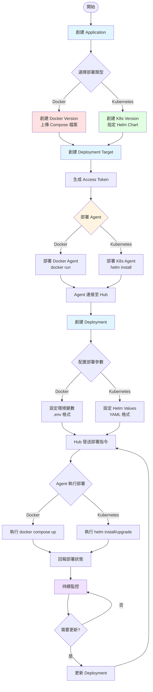
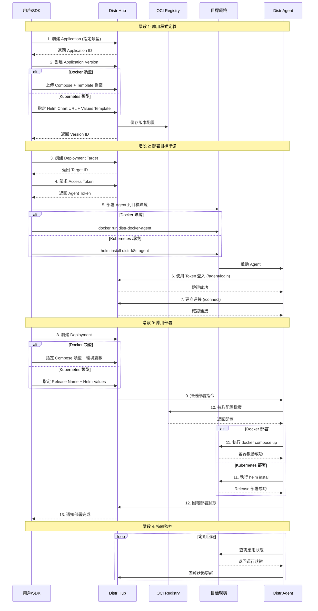
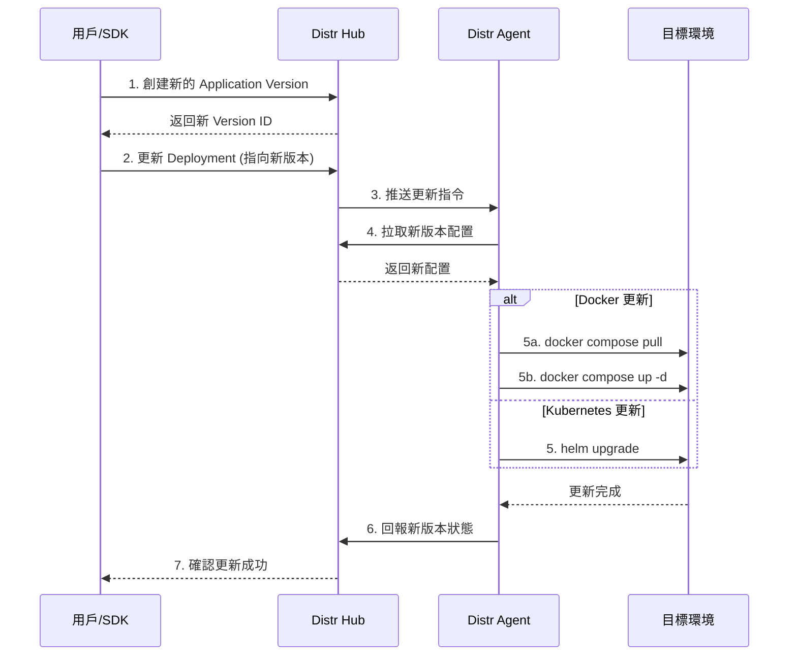
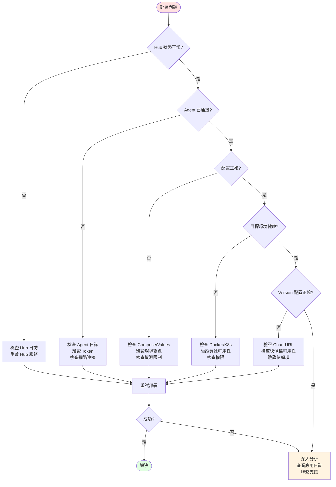

# Distr 部署商業流程文件

## 概述

Distr 平台提供統一的部署流程，支援兩種目標環境：
- **Docker**：適用於單機或 Docker Swarm 環境
- **Kubernetes**：適用於 K8s 叢集環境

雖然兩種類型的配置格式不同，但核心商業流程完全一致。

---

## 核心商業流程

### 1. 應用程式定義階段

創建應用程式並定義其版本資訊。

| 步驟 | Docker 類型 | Kubernetes 類型 |
|------|------------|----------------|
| **創建 Application** | `type: "docker"` | `type: "kubernetes"` |
| **創建 Version** | 上傳 Docker Compose 檔案 | 指定 Helm Chart（OCI 或 Repository） |
| **版本配置** | compose.yml + .env template | values.yaml + template |

**關鍵差異**：
- Docker：使用 Docker Compose 格式定義服務
- Kubernetes：使用 Helm Chart 管理部署資源

---

### 2. 部署目標準備階段

配置目標環境並部署 Agent。

| 步驟 | Docker 類型 | Kubernetes 類型 |
|------|------------|----------------|
| **創建 Deployment Target** | 定義 Docker 主機資訊 | 定義 Namespace/Cluster Scope |
| **取得 Access Token** | 生成 Agent 連接憑證 | 生成 Agent 連接憑證 |
| **部署 Agent** | Docker 容器運行 | Helm Chart 部署到叢集 |
| **Agent 連接** | 連接至 Hub 並註冊 | 連接至 Hub 並註冊 |

**關鍵差異**：
- Docker：Agent 以容器形式運行，掛載 Docker Socket
- Kubernetes：Agent 以 Deployment 形式運行在叢集內

---

### 3. 應用部署階段

執行實際部署並管理生命週期。

| 步驟 | Docker 類型 | Kubernetes 類型 |
|------|------------|----------------|
| **創建 Deployment** | 指定 compose 類型（compose/swarm） | 指定 release name |
| **配置參數** | 提供環境變數（.env 格式） | 提供 Helm Values（YAML） |
| **Agent 執行** | `docker compose up` | `helm install/upgrade` |
| **狀態回報** | 容器運行狀態 | Pod/Deployment 狀態 |

**關鍵差異**：
- Docker：使用 Docker Compose CLI 執行
- Kubernetes：使用 Helm CLI 執行

---

### 4. 持續管理階段

監控、更新和維護已部署的應用。

| 操作 | 實現方式 |
|------|---------|
| **版本升級** | 更新 Deployment 指向新的 Application Version |
| **配置變更** | 更新環境變數或 Helm Values |
| **監控狀態** | Agent 定期回報部署狀態至 Hub |
| **日誌收集** | 可選啟用日誌串流功能 |
| **強制重啟** | 觸發 Agent 重新部署 |

---

## 整體流程圖



---

## 組件互動循序圖

### 場景 1：初始部署流程



### 場景 2：版本更新流程



---

## 關鍵商業規則

### 1. 類型一致性
- Application 創建時指定的類型（docker/kubernetes）決定所有後續操作
- Deployment Target 必須與 Application 類型匹配
- 同一個 Application 可部署到多個相同類型的 Target

### 2. 版本管理
- 每個 Application Version 是不可變的（Immutable）
- 更新部署透過切換 Version，而非修改現有 Version
- 支援多版本並存於不同 Deployment Target

### 3. Agent 自主性
- Agent 是無狀態的執行器，配置由 Hub 集中管理
- 連接斷開後重連時，Agent 會同步最新配置
- Agent 故障不影響其他 Target 的部署

### 4. 配置分離
- Application Version 儲存應用結構（Compose/Chart）
- Deployment 儲存環境特定配置（Env/Values）
- 同一 Version 可用不同配置部署到多個環境

---

## 部署類型對比總結

| 項目 | Docker 部署 | Kubernetes 部署 |
|------|-----------|----------------|
| **配置格式** | Docker Compose YAML | Helm Chart |
| **參數化方式** | 環境變數 (.env) | Helm Values (YAML) |
| **Agent 類型** | docker-agent | kubernetes-agent |
| **部署命令** | `docker compose up` | `helm install/upgrade` |
| **更新策略** | 容器重建 | Rolling Update |
| **擴展方式** | Docker Swarm (可選) | K8s HPA/Deployment Replicas |
| **網路** | Docker Network | K8s Service/Ingress |
| **儲存** | Docker Volume | K8s PVC/PV |
| **適用場景** | 單機/小規模 | 生產級/叢集 |

---

## 最佳實踐建議

### 開發環境
1. 使用 Docker 類型快速迭代
2. 本機運行 Hub + Docker Agent
3. 頻繁創建新 Version 測試變更

### 測試環境
1. 使用與生產相同的類型（通常為 Kubernetes）
2. 獨立的 Deployment Target
3. 使用接近生產的 Helm Values

### 生產環境
1. 優先選擇 Kubernetes 部署
2. 每個環境獨立的 Deployment Target
3. 啟用監控和日誌收集
4. 使用 GitOps 流程管理 Version 創建
5. 實施藍綠部署或金絲雀發布策略

---

## 故障排除流程



---

## 附錄：快速參考

### 使用 SDK 創建完整部署（Kubernetes 範例）

```typescript
import { DistrService } from '@glasskube/distr-sdk';

const service = new DistrService({ apiKey: process.env.DISTR_API_KEY });

// 步驟 1-2: 創建 Application 和 Version
const app = await client.createApplication({ type: 'kubernetes', name: 'My App' });
const version = await service.createKubernetesApplicationVersion(
  app.id, 'v1.0.0',
  { chartType: 'oci', chartUrl: 'oci://registry/chart', chartVersion: '1.0.0' }
);

// 步驟 3-5: 創建 Deployment（含 Target）
const deployment = await service.createDeployment({
  target: { name: 'prod', type: 'kubernetes', kubernetes: { namespace: 'default' } },
  application: { versionId: version.id },
  kubernetesDeployment: { releaseName: 'my-app', valuesYaml: 'replicas: 3' },
});

// 步驟 6: 部署 Agent（手動執行）
const access = await client.createAccessForDeploymentTarget(deployment.deploymentTarget.id);
console.log(`helm install distr-agent ... --set hub.token=${access.token}`);
```

### 使用 SDK 更新部署

```typescript
await service.updateDeployment({
  deploymentTargetId: targetId,
  application: { versionId: newVersionId },  // 切換版本
  kubernetesDeployment: { valuesYaml: 'replicas: 5' },  // 更新配置
});
```

---

**文件版本**：1.0
**最後更新**：2025-10-28
**適用版本**：Distr v1.14.1+
